# Objection Project

Spring Boot 기반의 백엔드 서버 프로젝트입니다.

## 기술 스택

- Java 17
- Spring Boot 4.0.1
- Spring Data JPA
- Spring Data Redis
- MySQL 8.0.32
- Redis 7.x
- Gradle 9.2.1
- springdoc-openapi (Swagger UI)

## 시작하기

### 사전 요구사항

- JDK 17
- MySQL 8.0+
- Redis 7.0+

### 데이터베이스 설정

```sql
CREATE DATABASE objection_db;
CREATE USER 'objection_admin'@'localhost' IDENTIFIED BY 'objection1234';
GRANT ALL PRIVILEGES ON objection_db.* TO 'objection_admin'@'localhost';
FLUSH PRIVILEGES;
```

### Redis 실행 (로컬)

이 프로젝트는 **채팅 폴링 최적화(미변경 요청 비효율 개선)**를 위해 Redis 캐시를 사용합니다.

가장 간단한 방법은 `docker-compose.yml`로 Redis만 띄우는 것입니다:

```bash
# Redis 실행
docker compose up -d redis
# (구버전) docker-compose up -d redis

# Redis 중지/삭제
docker compose down
```

### 실행

```bash
# 빌드
./gradlew build

# 실행
./gradlew bootRun

# 테스트
./gradlew test

# 단일 테스트 실행
./gradlew test --tests "패키지명.클래스명"
```

## 프로젝트 구조

```
src/main/java/kuit/hackathon/proj_objection/
├── controller/     # REST API 엔드포인트
├── service/        # 비즈니스 로직
├── repository/     # 데이터 접근 계층
├── entity/         # JPA 엔티티
├── dto/            # 데이터 전송 객체
├── exception/      # 예외 클래스
├── config/         # 설정 클래스
└── annotation/     # 커스텀 어노테이션
```

## ERD (Mermaid)

> Entity 기준으로 작성한 ERD입니다. (컬럼명은 JPA/Hibernate 네이밍 전략에 따라 실제 DB에서는 달라질 수 있습니다.)

```mermaid
erDiagram
    USER {
        BIGINT id PK
        VARCHAR nickname UK
        VARCHAR password
        DATETIME created_at
        DATETIME modified_at
    }

    CHAT_ROOM {
        BIGINT id PK
        VARCHAR title
        VARCHAR participant_code UK
        VARCHAR observer_code UK
        BIGINT creator_id FK
        VARCHAR status
        BIGINT exit_requester_id FK
        DATETIME created_at
        DATETIME modified_at
    }

    CHAT_ROOM_MEMBER {
        BIGINT id PK
        BIGINT chat_room_id FK
        BIGINT user_id FK
        VARCHAR role
        INT percent
        DATETIME created_at
        DATETIME modified_at
    }

    CHAT_MESSAGE {
        BIGINT id PK
        BIGINT chat_room_id FK
        BIGINT sender_id FK
        TEXT content
        DATETIME created_at
        DATETIME modified_at
    }

    FINAL_JUDGEMENT {
        BIGINT id PK
        BIGINT chat_room_id FK
        VARCHAR winner
        VARCHAR plaintiff
        VARCHAR defendant
        INT winner_logic_score
        INT winner_empathy_score
        TEXT judgment_comment
        TEXT winner_reason
        TEXT loser_reason
        DATETIME created_at
        DATETIME modified_at
    }

    USER ||--o{ CHAT_ROOM : creates
    USER ||--o{ CHAT_ROOM : requests_exit

    CHAT_ROOM ||--o{ CHAT_ROOM_MEMBER : has
    USER ||--o{ CHAT_ROOM_MEMBER : joins

    CHAT_ROOM ||--o{ CHAT_MESSAGE : has
    USER ||--o{ CHAT_MESSAGE : sends

    CHAT_ROOM ||--o| FINAL_JUDGEMENT : has
```



## 아키텍처 다이어그램

<p align="center">

</p>


## 코딩 컨벤션

### 레이어 구조

**Controller -> Service -> Repository -> Entity** 순서로 호출합니다.

### 클래스 어노테이션

```java
// Controller
@RequiredArgsConstructor
@RestController
public class XxxController { }

// Service
@RequiredArgsConstructor
@Service
public class XxxService { }

// Repository
public interface XxxRepository extends JpaRepository<Xxx, Long> { }

// Entity
@Getter
@Entity
public class Xxx extends BaseEntity { }

// DTO
@Getter
@AllArgsConstructor
public class XxxDto { }
```

### Swagger 어노테이션

새로운 API를 추가할 때는 반드시 Swagger 어노테이션을 함께 작성합니다.

**Controller:**

```java
@Tag(name = "도메인명", description = "API 그룹 설명")
@RestController
public class XxxController {

    @Operation(summary = "API 요약 (한글)", description = "API 상세 설명")
    @ApiResponses({
            @ApiResponse(responseCode = "200", description = "성공"),
            @ApiResponse(responseCode = "400", description = "실패 사유",
                    content = @Content(schema = @Schema(implementation = BaseErrorResponse.class)))
    })
    @PostMapping("/xxx")
    public BaseResponse<XxxResponseDto> create(@RequestBody XxxRequestDto request) { }
}
```

**DTO:**

```java
@Schema(description = "DTO 설명")
@Getter
@AllArgsConstructor
public class XxxRequestDto {

    @Schema(description = "필드 설명", example = "예시값")
    private String fieldName;
}
```

**@LoginUser 파라미터 숨김 처리:**

```java
public BaseResponse<String> method(@Parameter(hidden = true) @LoginUser User user) { }
```

### 의존성 주입

생성자 주입을 사용합니다. `@RequiredArgsConstructor`와 `final` 필드를 활용합니다.

```java
@RequiredArgsConstructor
@Service
public class LoginService {
    private final UserRepository userRepository;
    private final PasswordEncoder passwordEncoder;
}
```

### 로그인 유저 주입 (@LoginUser)

컨트롤러에서 로그인된 유저 정보가 필요할 때 `@LoginUser` 어노테이션을 사용합니다.

```java
@GetMapping("/me")
public BaseResponse<String> getMyInfo(@LoginUser User user) {
    return new BaseResponse<>(user.getNickname());
}
```

`LoginUserArgumentResolver`가 세션에서 userId를 추출하고 User 엔티티를 조회합니다.
로그인하지 않았거나 유저가 존재하지 않으면 `UserNotFoundException`이 발생합니다.

### Entity

- 모든 엔티티는 `BaseEntity`를 상속하여 `createdAt`, `modifiedAt` 필드를 자동 관리합니다.
- 정적 팩토리 메서드 `create()`를 사용하여 객체를 생성합니다.

```java
@Getter
@Entity
public class User extends BaseEntity {
    @Id
    @GeneratedValue(strategy = GenerationType.IDENTITY)
    private Long id;

    public static User create(String nickname, String password) {
        User user = new User();
        user.nickname = nickname;
        user.password = password;
        return user;
    }
}
```

### API 응답 형식

**성공 응답**: `BaseResponse<T>`

```json
{
  "success": true,
  "code": 200,
  "result": "데이터"
}
```

**에러 응답**: `BaseErrorResponse`

```json
{
  "success": false,
  "code": 400,
  "result": "에러 메시지"
}
```

### 예외 처리

1. `BaseException`을 상속한 커스텀 예외 클래스를 생성합니다.
2. `MainExceptionHandler`에 해당 예외 핸들러를 등록합니다.

```java
// 1. 예외 클래스 생성
public class LoginException extends BaseException {
    public LoginException() {
        super(HttpStatus.BAD_REQUEST, "로그인에 실패했습니다.");
    }
}

// 2. 핸들러 등록
@ExceptionHandler({LoginException.class})
public BaseErrorResponse handle_LoginException(LoginException exception) {
    log.error("MainExceptionHandler.handle_LoginException <{}> {}", exception.getMessage(), exception);
    return BaseErrorResponse.of(exception);
}
```

### 테스트 컨벤션

BDD Mockito 기반의 given-when-then 패턴을 사용합니다.

```java
@ExtendWith(MockitoExtension.class)
class XxxServiceTest {

    @Mock
    private XxxRepository xxxRepository;

    @InjectMocks
    private XxxService xxxService;

    @Test
    @DisplayName("테스트 설명 (한글)")
    void methodName_condition_expectedResult() {
        // given
        given(xxxRepository.findById(1L)).willReturn(Optional.of(xxx));

        // when
        Xxx result = xxxService.find(1L);

        // then
        assertThat(result).isEqualTo(xxx);
        then(xxxRepository).should(times(1)).findById(1L);
    }
}
```

## API 엔드포인트

| Method | Endpoint   | Description         |
|--------|------------|---------------------|
| POST   | /login     | 로그인 (자동 회원가입) |
| POST   | /logout    | 로그아웃             |
| GET    | /test      | 서버 상태 확인        |
| GET    | /test/me   | 로그인 유저 정보 확인  |

## API 명세서 (Swagger)

서버 실행 후 아래 URL에서 API 명세서를 확인할 수 있습니다.

| 환경 | Swagger UI | OpenAPI JSON |
|------|------------|--------------|
| 로컬 | http://localhost:8080/swagger-ui.html | http://localhost:8080/v3/api-docs |

### Swagger 설정 변경

`application.yml`에서 API 정보를 수정할 수 있습니다:

```yaml
springdoc:
  info:
    title: 이의있오 API
    description: 이의있오 프로젝트 API 명세서
    version: v1.0.0
```

## 환경 설정

### 개발 환경

`application.yml`에서 직접 DB/Redis 정보를 설정합니다.

### 운영 환경

환경 변수를 사용합니다:
- `MYSQL_URL`
- `MYSQL_USERNAME`
- `MYSQL_PASSWORD`
- `OPENAI_API_KEY`
- `REDIS_HOST` (default: `localhost`)
- `REDIS_PORT` (default: `6379`)
- `REDIS_PASSWORD` (default: empty)

### Hibernate DDL

- `create`: 개발 초기 (테이블 재생성)
- `update`: 개발 중 (스키마 변경 반영)
- `none`: 운영 환경

## 배포

### 아키텍처

```
GitHub (main push) → GitHub Actions → Docker Hub → EC2 → RDS (MySQL)
```

### CD 파이프라인

`main` 브랜치에 push하면 자동으로 배포됩니다:

1. GitHub Actions가 Docker 이미지 빌드
2. Docker Hub에 이미지 push
3. SSH로 EC2 접속하여 새 이미지 pull & run

### GitHub Secrets 설정

GitHub 저장소 → Settings → Secrets and variables → Actions에서 설정:

| Secret | 설명 | 예시 |
|--------|------|------|
| `DOCKERHUB_USERNAME` | Docker Hub 사용자명 | `yourusername` |
| `DOCKERHUB_TOKEN` | Docker Hub Access Token | Docker Hub → Account Settings → Security |
| `EC2_HOST` | EC2 퍼블릭 IP | `13.125.xxx.xxx` |
| `EC2_USERNAME` | SSH 사용자명 | `ubuntu` 또는 `ec2-user` |
| `EC2_SSH_KEY` | EC2 SSH 프라이빗 키 전체 | `-----BEGIN RSA...` |
| `MYSQL_URL` | RDS 접속 URL | `jdbc:mysql://xxx.rds.amazonaws.com:3306/objection_db?serverTimezone=Asia/Seoul` |
| `MYSQL_USERNAME` | RDS 사용자명 | `admin` |
| `MYSQL_PASSWORD` | RDS 비밀번호 | `your-password` |
| `OPENAI_API_KEY` | OpenAI API Key | `sk-...` |

### EC2 사전 준비

```bash
# Docker 설치 (Ubuntu)
sudo apt-get update
sudo apt-get install -y docker.io
sudo systemctl start docker
sudo systemctl enable docker
sudo usermod -aG docker $USER

# 재접속 후 확인
docker --version
```

**보안 그룹 설정:**
- 인바운드: 22 (SSH), 8080 (App)
- RDS 보안 그룹: EC2에서 3306 접근 허용

### 로컬 Docker 테스트

```bash
# 빌드
docker build -t proj-objection:test .

# Redis 실행 (먼저)
docker compose up -d redis

# 실행
docker run -d -p 8080:8080 \
  --network proj-objection_default \
  -e SPRING_PROFILES_ACTIVE=prod \
  -e MYSQL_URL='jdbc:mysql://localhost:3306/objection_db?serverTimezone=Asia/Seoul' \
  -e MYSQL_USERNAME='objection_admin' \
  -e MYSQL_PASSWORD='objection1234' \
  -e OPENAI_API_KEY='your-openai-api-key' \
  -e REDIS_HOST='redis' \
  -e REDIS_PORT='6379' \
  -e REDIS_PASSWORD='' \
  proj-objection:test

# 로그 확인
docker logs -f $(docker ps -q --filter name=proj-objection)
```

### 배포 파일 구조

```
├── Dockerfile                    # 멀티스테이지 빌드
├── .dockerignore                 # Docker 빌드 제외 파일
└── .github/
    └── workflows/
        └── deploy.yml            # CD 파이프라인
```
