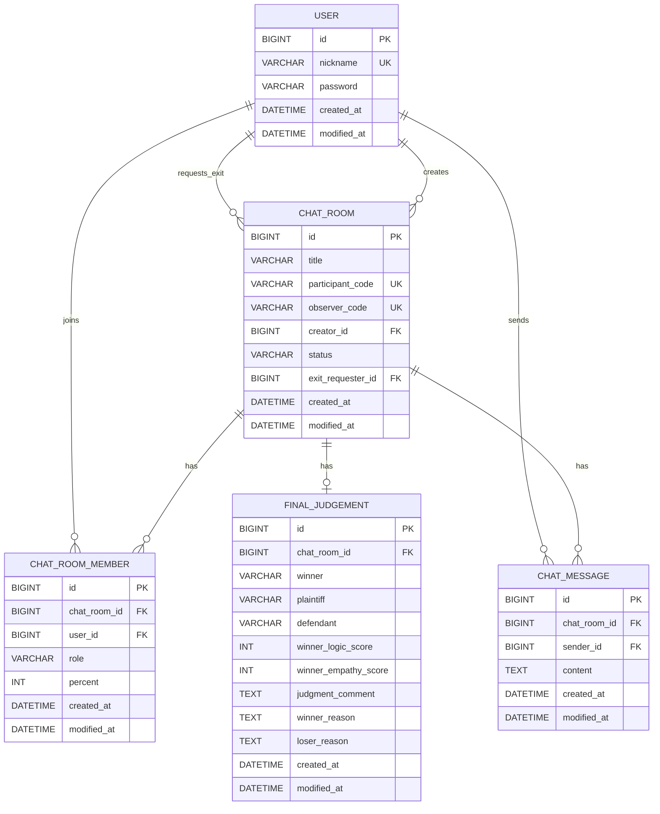

# Objection Project [이의있오]

Spring Boot 기반의 백엔드 서버 프로젝트입니다.

해당 프로젝트는 KUIT 6th Hackathon을 위해 개발되었습니다.

**안드로이드 깃허브 주소**
[Android Github](https://github.com/AI-COURT-FE/AI-COURT-FE)


## 기술 스택

- Java 17
- Spring Boot 4.0.1
- Spring Data JPA
- Spring Data Redis
- MySQL 8.0.32
- Redis 7.x
- Gradle 9.2.1
- springdoc-openapi (Swagger UI)

## 시작하기

### 사전 요구사항

- JDK 17
- MySQL 8.0+
- Redis 7.0+

### 데이터베이스 설정

```sql
CREATE DATABASE objection_db;
CREATE USER 'objection_admin'@'localhost' IDENTIFIED BY 'objection1234';
GRANT ALL PRIVILEGES ON objection_db.* TO 'objection_admin'@'localhost';
FLUSH PRIVILEGES;
```

### Redis 실행 (로컬)

이 프로젝트는 **채팅 폴링 최적화(미변경 요청 비효율 개선)**를 위해 Redis 캐시를 사용합니다.

가장 간단한 방법은 `docker-compose.yml`로 Redis만 띄우는 것입니다:

```bash
# Redis 실행
docker compose up -d redis
# (구버전) docker-compose up -d redis

# Redis 중지/삭제
docker compose down
```

### 실행

```bash
# 빌드
./gradlew build

# 실행
./gradlew bootRun

# 테스트
./gradlew test

# 단일 테스트 실행
./gradlew test --tests "패키지명.클래스명"
```

## 프로젝트 구조

```
src/main/java/kuit/hackathon/proj_objection/
├── controller/     # REST API 엔드포인트
├── service/        # 비즈니스 로직
├── repository/     # 데이터 접근 계층
├── entity/         # JPA 엔티티
├── dto/            # 데이터 전송 객체
├── exception/      # 예외 클래스
├── config/         # 설정 클래스
└── annotation/     # 커스텀 어노테이션
```

## ERD (Mermaid)

> Entity 기준으로 작성한 ERD입니다. (컬럼명은 JPA/Hibernate 네이밍 전략에 따라 실제 DB에서는 달라질 수 있습니다.)



## 아키텍처 다이어그램

<p align="center">

</p>

## 프로젝트 소개

**Objection**은 AI 기반 토론 분석 및 판결 플랫폼입니다. 두 명의 참여자(PARTICIPANT)가 주장을 펼치고, 관전자(OBSERVER)들이 이를 지켜보며, AI가 실시간으로 토론을 분석하여 최종 판결을 내리는 서비스입니다.

### 핵심 특징

- **실시간 토론 분석**: OpenAI GPT를 활용하여 대화 중 실시간으로 각 참여자의 우세도(percent) 분석
- **초대 코드 시스템**: 두 가지 초대 코드(참여자용/관전자용)로 역할을 구분하여 입장
- **비동기 AI 처리**: 메시지 전송과 AI 분석을 분리하여 사용자 경험 최적화
- **Redis 폴링 최적화**: 주기적 폴링 시 Redis 캐시를 활용하여 불필요한 DB 조회 최소화
- **최종 판결문**: 토론 종료 시 AI가 승자 결정, 논리/공감 점수, 판결 사유 등을 포함한 판결문 생성

## 주요 기능

### 1. 인증 시스템 (Authentication)

**세션 기반 인증** 방식을 사용합니다. 토큰이 아닌 HTTP 세션으로 사용자를 관리합니다.

- **자동 회원가입**: 닉네임과 비밀번호로 로그인 시도 시, 존재하지 않는 사용자는 자동으로 생성됨
- **비밀번호 암호화**: BCrypt를 사용하여 비밀번호를 안전하게 해싱
- **세션 타임아웃**: 30분 동안 활동이 없으면 자동 로그아웃

**관련 파일**:
- `LoginController`: 로그인 API 엔드포인트 (`POST /login`)
- `LoginService`: 로그인 비즈니스 로직 처리
- `@LoginUser`: 컨트롤러에서 로그인된 사용자를 자동 주입하는 커스텀 어노테이션
- `LoginUserArgumentResolver`: `@LoginUser` 어노테이션 처리 (세션에서 userId 추출 → User 엔티티 조회)

### 2. 채팅방 시스템 (Chat Room)

**채팅방 생성, 입장, 메시지 송수신, 종료 요청/수락**을 지원합니다.

#### 채팅방 상태 (RoomStatus)

| 상태 | 설명 |
|------|------|
| `ALIVE` | 정상 운영 중 |
| `REQUEST_FINISH` | 종료 요청 대기 중 (한 PARTICIPANT가 판결 요청) |
| `REQUEST_ACCEPT` | 종료 요청 수락, 판결문 생성 중 |
| `DONE` | 종료됨 (판결문 생성 완료) |

#### 참여자 역할 (MemberRole)

- **PARTICIPANT**: 대화 상대방 - 메시지 전송 가능, 종료 요청/수락 가능 (최대 2명)
- **OBSERVER**: 관전자 - 메시지 조회만 가능 (무제한)

#### 초대 코드 시스템

채팅방 생성 시 두 개의 초대 코드가 자동 생성됩니다:
- `participantCode` (형식: `0000-0000`): 대화 상대방 초대용
- `observerCode` (형식: `0000-0000`): 관전자 초대용

#### 판결(종료) 흐름

```
1. PARTICIPANT A → 판결 요청 (/exit/request)
   └─ 상태: ALIVE → REQUEST_FINISH

2. PARTICIPANT B → 판결 수락/거절 (/exit/decide)
   ├─ 수락: REQUEST_FINISH → REQUEST_ACCEPT → AI 분석 시작
   │   └─ AI 분석 완료 후: REQUEST_ACCEPT → DONE
   └─ 거절: REQUEST_FINISH → ALIVE
```

**관련 파일**:
- `ChatRoom`: 채팅방 엔티티 (title, participantCode, observerCode, status, exitRequester)
- `ChatRoomMember`: 채팅방 멤버 엔티티 (chatRoom, user, role, percent)
- `ChatMessage`: 채팅 메시지 엔티티
- `ChatRoomController`: 채팅방 생성/입장/종료 API
- `ChatMessageController`: 메시지 전송/조회 API
- `ChatRoomService`: 채팅방 비즈니스 로직

### 3. 채팅 폴링 (Chat Polling)

클라이언트가 **주기적으로 폴링 API를 호출**하여 새로운 메시지, 채팅방 상태, 승률(percent)을 조회합니다. **Redis 캐시를 활용**하여 불필요한 DB 조회를 최소화합니다.

#### 폴링 방식

```
클라이언트 → GET /chat/poll?chatRoomId=1&lastMessageId=123
서버 → 즉시 응답 (새 메시지 + 상태 + percent)
```

- 클라이언트는 일정 주기(예: 1~2초)로 폴링 요청
- `lastMessageId` 이후의 새 메시지만 반환
- 새 메시지가 없으면 빈 배열 반환

#### 폴링 최적화 전략 (Redis 캐싱)

**캐시 키 구조**:
```
chat:room:{chatRoomId}:lastMessageId  → 마지막 메시지 ID (Long)
chat:room:{chatRoomId}:percent        → 참여자별 점수 (Map<String, Integer>)
chat:room:{chatRoomId}:status         → 채팅방 상태 + 종료 요청자 닉네임
```

**폴링 흐름**:
1. **Redis 캐시 HIT 시**:
   - Redis에서 `lastMessageId` 조회
   - 클라이언트의 `lastMessageId`보다 크면 → 새 메시지만 DB에서 조회
   - `percent`, `status`는 Redis에서 조회 (DB 접근 없음)

2. **Redis 캐시 MISS 시**:
   - DB에서 전체 데이터 조회 (메시지, 멤버, 상태)
   - 조회한 데이터를 Redis에 캐싱 (TTL: 1시간)

3. **Redis 장애 시**:
   - 자동으로 DB로 Fallback
   - 정상 응답 반환 (서비스 중단 없음)

#### 폴링 응답 데이터

```json
{
  "success": true,
  "code": 200,
  "result": {
    "messages": [
      {
        "messageId": 124,
        "senderNickname": "유저A",
        "content": "그건 논리적이지 않아요",
        "createdAt": "2026-01-10T14:30:00"
      }
    ],
    "chatRoomStatus": "ALIVE",
    "finishRequestNickname": null,
    "percent": {
      "유저A": 48,
      "유저B": 52
    }
  }
}
```

**관련 파일**:
- `ChatPollController`: 폴링 API 엔드포인트 (`GET /chat/poll`)
- `ChatPollService`: 폴링 로직 처리 (캐시 HIT/MISS 분기)
- `ChatRoomCacheService`: Redis 캐시 CRUD (lastMessageId, percent, status)
- `RedisConfig`: Redis 연결 설정

### 4. AI 토론 분석 (Debate Analysis)

**OpenAI GPT 모델**을 활용하여 토론 내용을 실시간으로 분석합니다.

#### 실시간 우세도 분석 (Percent)

- **트리거**: 메시지 전송 시마다 비동기로 AI 분석 실행
- **분석 내용**: 각 참여자의 현재 우세도를 0~100% 범위로 계산 (두 참여자의 합이 100%)
- **비동기 처리**: `@Async` 어노테이션으로 메인 스레드를 블로킹하지 않음
- **결과 저장**:
  - `ChatRoomMember` 엔티티의 `percent` 필드에 저장 (DB)
  - Redis 캐시(`chat:room:{id}:percent`)에도 저장하여 폴링 최적화

#### 최종 판결문 생성 (Final Judgement)

판결 수락 시 비동기로 AI 분석을 수행하여 최종 판결문을 생성합니다.

**판결문 포함 내용**:
- **winner**: 승자 닉네임
- **plaintiff / defendant**: 원고/피고 닉네임
- **winnerLogicScore / winnerEmpathyScore**: 승자의 논리력/공감력 점수 (0~100)
- **judgmentComment**: 전체 판결 요약
- **winnerReason**: 승자가 이긴 이유
- **loserReason**: 패자가 진 이유

**관련 파일**:
- `OpenAiClient` / `OpenAiClientImpl`: OpenAI API 클라이언트 (src/main/java/kuit/hackathon/proj_objection/client/openai/)
- `OpenAiChatProcessor`: OpenAI 호출 및 응답 파싱 로직
- `DebateAnalysisService`: 실시간 우세도 분석 (비동기)
- `AsyncJudgmentService`: 최종 판결문 생성 (비동기)
- `FinalJudgementService`: 판결문 조회 서비스
- `FinalJudgement`: 최종 판결문 엔티티

#### AI 프롬프트 전략

- **실시간 분석**: 최근 대화 내용을 기반으로 각 참여자의 논리적 우세도 계산
- **최종 판결**: 전체 대화 내용을 분석하여 논리력/공감력 점수, 승패 결정, 판결 사유 도출

### 5. 예외 처리 (Exception Handling)

통일된 예외 처리 구조로 일관성 있는 에러 응답을 제공합니다.

#### 예외 계층 구조

```
BaseException (추상)
├─ LoginException                           (로그인 실패)
├─ UserNotFoundException                    (사용자 없음)
├─ ChatRoomNotFoundException                (채팅방 없음)
├─ ChatRoomFullException                    (채팅방 인원 초과)
├─ ChatRoomClosedException                  (채팅방 종료됨)
├─ InvalidInviteCodeException               (잘못된 초대 코드)
├─ MessageSendPermissionDeniedException     (메시지 전송 권한 없음)
├─ ExitRequestPermissionDeniedException     (종료 요청 권한 없음)
├─ ExitDecisionPermissionDeniedException    (종료 결정 권한 없음)
├─ NoExitRequestException                   (종료 요청 없음)
├─ OpenAiApiException                       (OpenAI API 호출 실패)
└─ ...
```

**관련 파일**:
- `BaseException`: 모든 커스텀 예외의 부모 클래스 (HttpStatus, message 포함)
- `MainExceptionHandler`: `@RestControllerAdvice`로 전역 예외 처리

## 핵심 코드 설명

### @LoginUser 어노테이션 사용법

컨트롤러에서 현재 로그인된 사용자를 자동으로 주입받을 수 있습니다.

```java
@GetMapping("/me")
public BaseResponse<String> getMyInfo(@LoginUser User user) {
    return new BaseResponse<>(user.getNickname());
}
```

`LoginUserArgumentResolver`가 세션에서 `userId`를 추출하여 User 엔티티를 조회합니다. 로그인하지 않았거나 사용자가 존재하지 않으면 `UserNotFoundException`이 발생합니다.

### Entity 생성 패턴 (정적 팩토리 메서드)

엔티티 생성 시 생성자 대신 정적 팩토리 메서드 `create()`를 사용합니다.

```java
// ChatRoom 생성 예시
ChatRoom chatRoom = ChatRoom.create(creator);

// 자동으로 초대 코드 생성, 상태 초기화 등이 수행됨
// participantCode: "1234-5678" (자동 생성)
// observerCode: "8765-4321" (자동 생성)
// status: ALIVE (기본값)
```

이 패턴은 다음과 같은 장점을 제공합니다:
- 의미 있는 메서드 이름으로 가독성 향상
- 객체 생성 로직을 엔티티 내부에 캡슐화
- 필요한 경우 초기화 로직(초대 코드 생성, 제목 생성 등) 자동 수행

### BaseEntity 상속

모든 엔티티는 `BaseEntity`를 상속하여 생성일시(`createdAt`)와 수정일시(`modifiedAt`)를 자동으로 관리합니다.

```java
@Getter
@MappedSuperclass
@EntityListeners(AuditingEntityListener.class)
public abstract class BaseEntity {
    @CreatedDate
    @Column(updatable = false)
    private LocalDateTime createdAt;

    @LastModifiedDate
    private LocalDateTime modifiedAt;
}
```

### 비동기 처리 (Async)

AI 분석 같은 오래 걸리는 작업은 비동기로 처리하여 메인 API 응답 시간에 영향을 주지 않습니다.

```java
@Async("aiAnalysisExecutor")
@Transactional
public void analyzeAndUpdateScores(Long chatRoomId) {
    // OpenAI 분석 (블로킹되지만 별도 스레드에서 실행)
    Map<String, Integer> scores = openAiChatProcessor.analyzePercent(chatRoomId);

    // DB 업데이트
    // Redis 캐시 업데이트
}
```

- `@Async` 어노테이션으로 별도 스레드 풀에서 실행
- `AsyncConfig`에서 스레드 풀 설정 (core: 2, max: 5)
- 메시지 전송 API는 즉시 응답, AI 분석은 백그라운드에서 진행

### Redis 캐싱 전략

폴링 최적화를 위해 자주 조회되는 데이터를 Redis에 캐싱합니다.

**캐시 키 구조**:
```
chat:room:{chatRoomId}:lastMessageId  → Long (마지막 메시지 ID)
chat:room:{chatRoomId}:percent        → JSON (Map<String, Integer>)
chat:room:{chatRoomId}:status         → JSON (ChatRoomStatusCache)
```

**캐시 갱신 시점**:
- **lastMessageId**: 새 메시지 전송 시
- **status**: 채팅방 상태 변경 시 (종료 요청, 수락, 거절)
- **percent**: AI 분석 완료 시

**TTL**: 1시간 (자동 만료)

## API 문서

Swagger UI를 통해 모든 API를 확인하고 테스트할 수 있습니다.

**접근 경로**: `http://localhost:8080/swagger-ui.html`

주요 API 엔드포인트:

| 메서드 | 경로 | 설명 |
|--------|------|------|
| `POST` | `/login` | 로그인 (자동 회원가입 포함) |
| `GET` | `/test/session` | 세션 확인 (인증 테스트용) |
| `POST` | `/chat/room/create` | 채팅방 생성 |
| `POST` | `/chat/room/join` | 초대 코드로 채팅방 입장 |
| `POST` | `/chat/room/{chatRoomId}/message` | 메시지 전송 |
| `GET` | `/chat/room/{chatRoomId}/messages` | 메시지 목록 조회 |
| `GET` | `/chat/poll` | 채팅 폴링 (새 메시지 + 상태 + percent 조회) |
| `POST` | `/chat/room/{chatRoomId}/exit/request` | 판결 요청 |
| `POST` | `/chat/room/{chatRoomId}/exit/decide` | 판결 수락/거절 |
| `GET` | `/chat/room/{chatRoomId}/judgement` | 최종 판결문 조회 |


## 코딩 컨벤션

### 레이어 구조

**Controller -> Service -> Repository -> Entity** 순서로 호출합니다.

### 클래스 어노테이션

```java
// Controller
@RequiredArgsConstructor
@RestController
public class XxxController { }

// Service
@RequiredArgsConstructor
@Service
public class XxxService { }

// Repository
public interface XxxRepository extends JpaRepository<Xxx, Long> { }

// Entity
@Getter
@Entity
public class Xxx extends BaseEntity { }

// DTO
@Getter
@AllArgsConstructor
public class XxxDto { }
```

### Swagger 어노테이션

새로운 API를 추가할 때는 반드시 Swagger 어노테이션을 함께 작성합니다.

**Controller:**

```java
@Tag(name = "도메인명", description = "API 그룹 설명")
@RestController
public class XxxController {

    @Operation(summary = "API 요약 (한글)", description = "API 상세 설명")
    @ApiResponses({
            @ApiResponse(responseCode = "200", description = "성공"),
            @ApiResponse(responseCode = "400", description = "실패 사유",
                    content = @Content(schema = @Schema(implementation = BaseErrorResponse.class)))
    })
    @PostMapping("/xxx")
    public BaseResponse<XxxResponseDto> create(@RequestBody XxxRequestDto request) { }
}
```

**DTO:**

```java
@Schema(description = "DTO 설명")
@Getter
@AllArgsConstructor
public class XxxRequestDto {

    @Schema(description = "필드 설명", example = "예시값")
    private String fieldName;
}
```

**@LoginUser 파라미터 숨김 처리:**

```java
public BaseResponse<String> method(@Parameter(hidden = true) @LoginUser User user) { }
```

### 의존성 주입

생성자 주입을 사용합니다. `@RequiredArgsConstructor`와 `final` 필드를 활용합니다.

```java
@RequiredArgsConstructor
@Service
public class LoginService {
    private final UserRepository userRepository;
    private final PasswordEncoder passwordEncoder;
}
```

### 로그인 유저 주입 (@LoginUser)

컨트롤러에서 로그인된 유저 정보가 필요할 때 `@LoginUser` 어노테이션을 사용합니다.

```java
@GetMapping("/me")
public BaseResponse<String> getMyInfo(@LoginUser User user) {
    return new BaseResponse<>(user.getNickname());
}
```

`LoginUserArgumentResolver`가 세션에서 userId를 추출하고 User 엔티티를 조회합니다.
로그인하지 않았거나 유저가 존재하지 않으면 `UserNotFoundException`이 발생합니다.

### Entity

- 모든 엔티티는 `BaseEntity`를 상속하여 `createdAt`, `modifiedAt` 필드를 자동 관리합니다.
- 정적 팩토리 메서드 `create()`를 사용하여 객체를 생성합니다.

```java
@Getter
@Entity
public class User extends BaseEntity {
    @Id
    @GeneratedValue(strategy = GenerationType.IDENTITY)
    private Long id;

    public static User create(String nickname, String password) {
        User user = new User();
        user.nickname = nickname;
        user.password = password;
        return user;
    }
}
```

### API 응답 형식

**성공 응답**: `BaseResponse<T>`

```json
{
  "success": true,
  "code": 200,
  "result": "데이터"
}
```

**에러 응답**: `BaseErrorResponse`

```json
{
  "success": false,
  "code": 400,
  "result": "에러 메시지"
}
```

### 예외 처리

1. `BaseException`을 상속한 커스텀 예외 클래스를 생성합니다.
2. `MainExceptionHandler`에 해당 예외 핸들러를 등록합니다.

```java
// 1. 예외 클래스 생성
public class LoginException extends BaseException {
    public LoginException() {
        super(HttpStatus.BAD_REQUEST, "로그인에 실패했습니다.");
    }
}

// 2. 핸들러 등록
@ExceptionHandler({LoginException.class})
public BaseErrorResponse handle_LoginException(LoginException exception) {
    log.error("MainExceptionHandler.handle_LoginException <{}> {}", exception.getMessage(), exception);
    return BaseErrorResponse.of(exception);
}
```

### 테스트 컨벤션

BDD Mockito 기반의 given-when-then 패턴을 사용합니다.

```java
@ExtendWith(MockitoExtension.class)
class XxxServiceTest {

    @Mock
    private XxxRepository xxxRepository;

    @InjectMocks
    private XxxService xxxService;

    @Test
    @DisplayName("테스트 설명 (한글)")
    void methodName_condition_expectedResult() {
        // given
        given(xxxRepository.findById(1L)).willReturn(Optional.of(xxx));

        // when
        Xxx result = xxxService.find(1L);

        // then
        assertThat(result).isEqualTo(xxx);
        then(xxxRepository).should(times(1)).findById(1L);
    }
}
```


## 환경 설정

### 개발 환경

`application.yml`에서 직접 DB/Redis 정보를 설정합니다.

### 운영 환경

환경 변수를 사용합니다:
- `MYSQL_URL`
- `MYSQL_USERNAME`
- `MYSQL_PASSWORD`
- `OPENAI_API_KEY`
- `REDIS_HOST` (default: `localhost`)
- `REDIS_PORT` (default: `6379`)
- `REDIS_PASSWORD` (default: empty)

### Hibernate DDL

- `create`: 개발 초기 (테이블 재생성)
- `update`: 개발 중 (스키마 변경 반영)
- `none`: 운영 환경

## 배포

### 아키텍처

```
GitHub (main push) → GitHub Actions → Docker Hub → EC2 → RDS (MySQL)
```

### CD 파이프라인

`main` 브랜치에 push하면 자동으로 배포됩니다:

1. GitHub Actions가 Docker 이미지 빌드
2. Docker Hub에 이미지 push
3. SSH로 EC2 접속하여 새 이미지 pull & run


### 로컬 Docker 테스트

```bash
# 빌드
docker build -t proj-objection:test .

# Redis 실행 (먼저)
docker compose up -d redis

# 실행
docker run -d -p 8080:8080 \
  --network proj-objection_default \
  -e SPRING_PROFILES_ACTIVE=prod \
  -e MYSQL_URL='jdbc:mysql://localhost:3306/objection_db?serverTimezone=Asia/Seoul' \
  -e MYSQL_USERNAME='objection_admin' \
  -e MYSQL_PASSWORD='objection1234' \
  -e OPENAI_API_KEY='your-openai-api-key' \
  -e REDIS_HOST='redis' \
  -e REDIS_PORT='6379' \
  -e REDIS_PASSWORD='' \
  proj-objection:test

# 로그 확인
docker logs -f $(docker ps -q --filter name=proj-objection)
```
